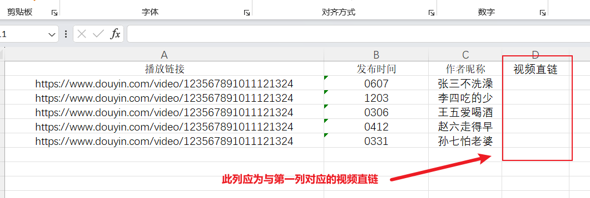

# 仓库简介
<p align="center">
    
    
    
</p>

<h3 align="center">部署Python环境直接运行源代码</h3>

<h3 align="center">步骤分解如下</h3>
<p align="center">
    
</p>


###  1、环境部署
<p align="center"><a href="https://registry.npmmirror.com/-/binary/python/3.13.0/python-3.13.0a1-amd64.exe" target="_blank">点我下载Python-Windows64位安装包</a></p>


<p align="center">
    
</p>


下载之后运行上图示的安装程序，按下图示勾选点击，进度条跑完显示successfully即为成功

<p align="center">
    
</p>

### 2、获取仓库代码
<p align="center">把下面的压缩文件解压</p>
<p align="center"><a href="https://gitee.com/LuckyNigel/230731/releases/download/Public/auto.zip" target="_blank">点我下载auto压缩文件包</a></p>

### 3、补足程序依赖
1. 在WIN徽标LOGO右键打开PowerShell（管理员）/ 终端管理员
2. CD命令切换到解压出来的目录，图示为切换到C盘当前用户的下载目录下的解压目录

<p align="center">
    
</p>


```
cd 此处中文应替换为你的解压后的文件夹路径
ls #执行这一行查看当前目录的文件 此步骤可选
```
3. 执行以下命令、等待执行结束
```
pip install -i https://pypi.tuna.tsinghua.edu.cn/simple -r requirements.txt
```
下图最后输出的两行，提示包管理工具需要升级，只要前面正常下载了，可以不理会，如果这里有红色报错，可以复制终端最后一行的绿色部分升级代码，升级下pip再次执行上面的代码
<p align="center">
    
</p>

### 4、程序前置文件
这里往后的步骤需要使用电商罗盘中下载的Excel文件，请事前下载报表的时候就对品名进行分类
请使用任意文本编辑器（或者使用你已经安装好的Python IDLE，这时候你可以在开始菜单找到）打开auto-Excel.py文件把下图所示的代码中的两个模块中的菜名替换改成你的品名，上下需要对应，有需要增删的项目可按照上下文语法格式书写，需要英文半角输入、编辑后需保存退出
<p align="center">
    
</p>


### 5、运行
1. 运行Excel预处理程序，在弹出的资源管理器中选择你从电商罗盘中下载的Excel文件，按照终端提示输入数字选择
2. 因为我暂时放弃了直链解析模块的后续迭代，这里需要使用第三方工具（电脑运行微信小程序“提取下载工具”解析）把第三方解析的直链填入预处理输出的Excel文件的第四列（示例见 Excel Demo.xlxs文件）
<p align="center">
    
</p>

3. 运行直链Download程序、选择填充好直链的Excel文件、选择一个视频保存目录

